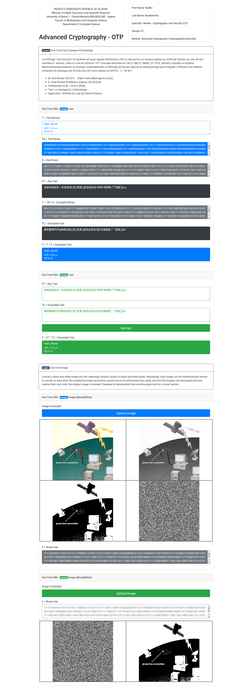

# ACPWOTP

Advanced Cryptography Practical Work One-Time PAD.

## IMPORTANT !

### This Practical Work For Educational Purposes Only!

## Get Started

1. `git clone https://github.com/NadhirBoukhenifra/ACPWOTP`
2. `cd ./ACPWOTP && yarn`
3. `google-chrome ./index.html`

## Algortihms

### Text Abbr

- **TP = Text Plain**
- **TU = Text Unicode**
- **TB = Text Binary**
- **KB = Key Binary**
- **KU = Key Unicode**
- **KP = Key Plain**
- **EB = Encrypted Binary**
- **EU = Encrypted Unicode**
- **EP = Encrypted Plain**
- **DB = Decrypted Binary**
- **DU = Decrypted Unicode**
- **DP = Decrypted Plain**

### OTP Text Encrypt

Auto Encrypt/Decrypt text.

1. TP = get TP.
2. TU = convert TP to TU.
3. TB = convert TU to TB.
4. KB = generate KB (KB.length = TB.length).
5. KU = convert KB to KU.
6. KP = convert KU to KP.
7. EB = encrypt TB ^ KB.
8. EU = convert EB to EU.
9. EP = convert EU to EP.
10. DB = decrypt EB ^ KB.
11. DU = convert DB to DU.
12. DP = convert DU to DP (DP = TP).

### OTP Text Decrypt

Decrypt using the key and the encrypted text.

1. KP = get KP.
2. KU = convert KP to KU.
3. KB = convert KU to KB.
4. EP = get EP.
5. EU = convert EP to EU.
6. EB = convert EU to EB.
7. DB = decrypt EB ^ KB.
8. DU = convert DB to DU.
9. DP = convert DU to DP (DP = TP).

### Image Abbr

- **IPC = Image Plain Colored**
- **IPG = Image Plain Grayscaled**
- **IPB = Image Plain Black&White**
- **IPBB = Image Plain Black&White Binary**
- **IPKB = Image Plain Key Binary**
- **IEBB = Image Encrypted Black&White Binary**
- **IEB = Image Encrypted Black&White**
- **IDBB = Image Decrypted Black&White Binary**
- **IDB = Image Decrypted Black&White**

### OTP Image Encrypt

1. IPC = get IPC.
2. IPG = convert IPC to IPG.
3. IPB = convert IPG to IPB.
4. IPBB = convert IPB to IPBB.
5. IPKB = generate IPKB (IPKB.length = IPBB.length).
6. IEBB = encrypt IPBB ^ IPKB.
7. IEB = convert IEBB to IEB.

### OTP Image Decrypt

1. IEB = get IEB.
2. IEBB = convert IEB to IEBB.
3. IPKB = get IPKB.
4. IDBB = decrypt IEBB ^ IPKB.
5. IDB = convert IDBB to IDB (IDB = IPB).

## Demo

## To-Do

- make tests.
- convert IPKB from binary key to image key.
- fix unicode ranges.
- resize images to full size.
- control inputs.
- ...

***
*Nadhir*

*University of Batna 2 - Chahid Mostefa BEN BOULAID - Algeria* 

*Faculty of Mathematics and Computer Science*

*Department of Computer Science*

*2018/2019*
